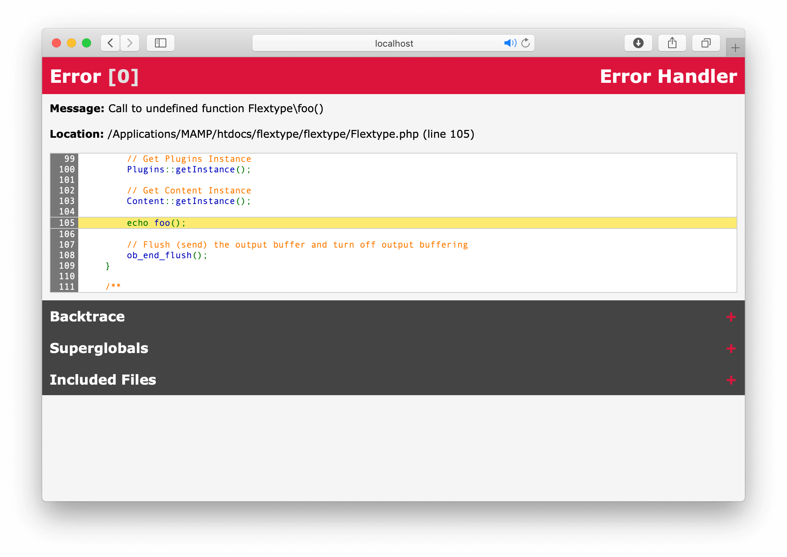

# Error Handler Component

[](https://github.com/flextype-components/errorhandler/blob/master/LICENSE)



Error Handler Component for errors handling.

### Installation

```
composer require flextype-components/errorhandler
```

### Usage

```php
use Flextype\Component\ErrorHandler\ErrorHandler;
```

Set error reporting level
```php
$show_errors = true;

if ($show_errors) {
    define('DEVELOPMENT', true);
    error_reporting(-1);
} else {
    define('DEVELOPMENT', false);
    error_reporting(0);
}
```

Set LOGS_PATH constant
```php
define('LOGS_PATH', 'path/to/logs');
```

Set Error handler
```php
set_error_handler('Flextype\Component\ErrorHandler\ErrorHandler::error');
register_shutdown_function('Flextype\Component\ErrorHandler\ErrorHandler::fatal');
set_exception_handler('Flextype\Component\ErrorHandler\ErrorHandler::exception');
```

## License
See [LICENSE](https://github.com/flextype-components/errorhandler/blob/master/LICENSE)
